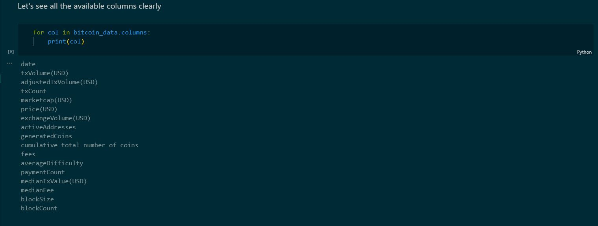
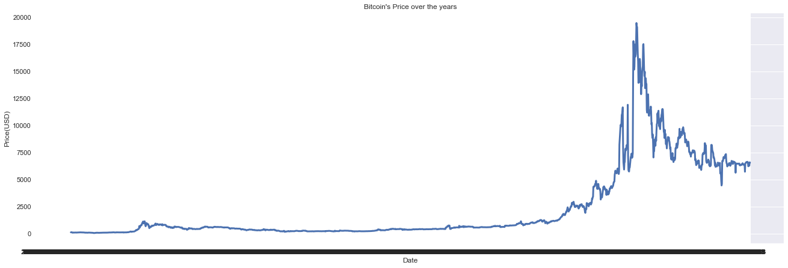
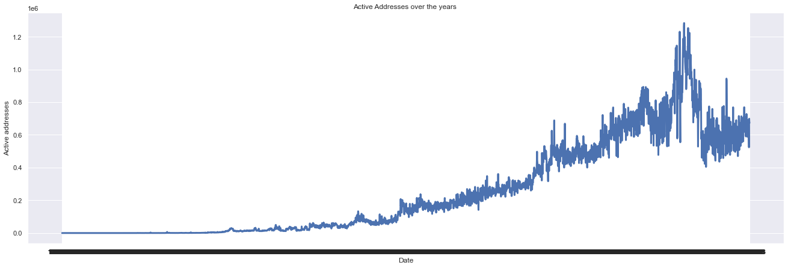
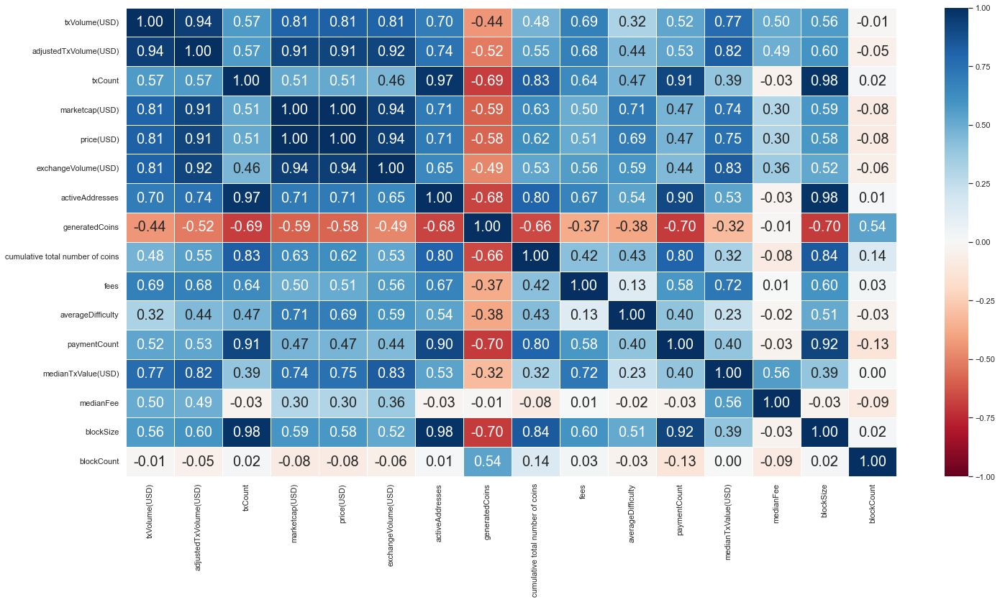
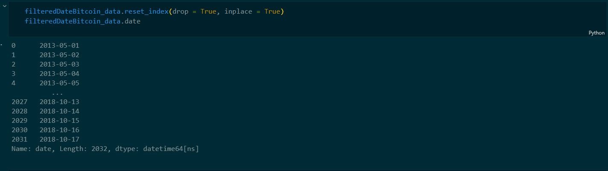
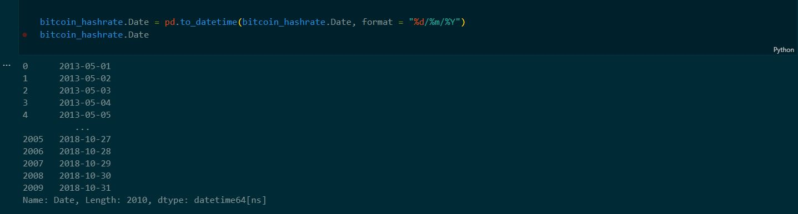
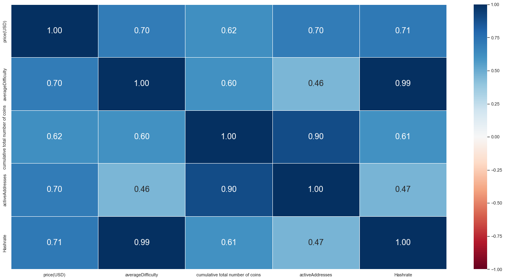

# SC1015-Mini-Project

<section>
  <h2> DSAI Data Science and Aritificial Intelligence Project </h2>
  <section>
   <p> Hello! We are Lin Kai, Yee Hao and Dhairya from Nanyang Technological University. Our project will be on Bitcoin, inspired by the relatively new rise of blockchain technology. There is a general notion that investment in Bitcoin is a high risk affair, due to the volatile nature of cryptocurrency, as well as the fact that it is 'not backed by anything', unlike most currencies. Our group finds the world of mining to be a truly fascinating one. </p>
    
   
   
   
   <h3>Problem Statement</h3>
   <p> With the recent boom in mining activity over the course of the pandemic, we could not help but wonder: how does mining activity affect Bitcoin pricing? Is Bitcoin actually an asset class worth considering? Or is it just an asset whose price is driven by tweets and memes and influencers? 
    <b>For simplicity sake, we will assume Bitcoin’s price is reflective of its state in the future.</p>
  
   </p>
    <h3>Bitcoin's price over the years</h3>
    
    
   <h3>A brief introduction to Bitcoin</h3>
    <p> Initially driven by a need for decentralized finance, it sought to remove the middleman in financial transactions. To gain control over your own assets, rather than putting your assets and fiat in banks where their value slowly drops due to rising interest rates. Satoshi Nakamoto then founded Bitcoin.</p>
    <h3>So, what exactly is going on behind the scene?</h3>
    <p>Miners, will directly "mine" for Bitcoin by solving a nounce value such that the nounce, together with the transaction data, forms the correct 32byte number generated by putting it through the SHA-256 algorithm (secure hashing algorithm). In that sense, miners use their computing power to solve the nounce value using brute force, generating every single combination possible to solve the puzzle. And thus, they are rewarded with a small amount of Bitcoin.</p>
    
  <h3>Transacting Bitcoin</h3>
  <p>Cryptocurrency assets like Bitcoin are stored in wallets, cold or hot. A cold wallet simply means an offline hardware wallet, while a hot wallet means that it is online like exchange platforms, possible to be hacked though the likelihood is very little. Someone with another wallet address will send the Bitcoin to your unique wallet address, ie: MetaMask, phamtom wallet, etc. Then, a small transaction fee is paid to miners for validating the Bitcoin network.  </p>
    
    
  <h3>Jargons used later</h3>
  <table>
  <tr>
      <th>blockCount</th>
      <td>A factor which measures the number of transactions or (blocks) in the blockchain</td>
  </tr>
  <tr>
      <th>blockSize</th>
      <td>A factor which measures how many transactions a block can store, the size of the block, which affects its scalability</td>
  </tr>
  <tr>
      <th>averageDifficulty</th>
      <td>How much reward in bitcoin is paid to the miners. </td>
  </tr>
  <tr>
      <th>Hashrate</th>
      <td>The computational power that the bitcoin network currently has (provided by the miners) to solve nounces to earn Bitcoin rewards</td>
  </tr>
  <tr>
      <th>Active Addresses</th>
      <td>The number of wallets containing bitcoin</td>
  </tr>
  <tr>
      <th>Cumulative coins</th>
      <td>The total number of Bitcoins</td>
  </tr>

  </table>
    
  <h2>Contents</h2>
    <p>Our project will be split into different segments:</p>
    <nav>
    <ol>
      <li><a href = "#Gathering-Data">Gathering Data</a></li>
      <li><a href = "#Exploratory-Data-Analysis">Exploratory Data Analysis</a></li>
      <li><a href = "#Data-Cleaning">Data Cleaning</a></li>
    </ol>
    </nav>
  </section>
  
</section>

<!--   =============================== DATA GATHERING HERE ======================================= -->
<section>
  <h2 id = "Gathering-Data">Data Gathering</h2>
  <p>In order to see if Bitcoin is backed or affected by any variable at all, we need to gather some information relevant to Bitcoin, as well its hashrate data. Unfortunately, the datasets we are after are separate, and needed to be combined together. This will be done in under "Data Cleaning".</p>
  
  <p>Bitcoin general data taken from:</p>
  <nav>
    <ul>
      <li><a href = "">*insert link here*</a></li>
    </ul>
  </nav>
  
  <p>Bitcoin hash rate data taken from:</p>
  <nav>
    <ul>
      <li><a href = "">*insert link here*</a></li>
    </ul>
  </nav>
  
  
  
  
</section>

<section>
<!--   =============================== EXPLORATORY DATA ANALYSIS HERE ======================================= -->
  <h2 id = "Exploratory-Data-Analysis">Exploratory Data Analysis</h2>
  
  <p>Exploratory Data Analysis will be split into the following:</p>
  <nav>
  <ol>
    <li><a href = "#relationship-data">Relationship between all of the variables.</a></li>
    <li><a href = "#narrow-data">Narrowing down relevant data</a></li>

  </ol>
  </nav>
  
  <h3 id = "relationship-data">Relationship between all of the variables</h3>
  <p>Looking at all of the variables of the bitcoin data excluding hashrate in the first dataset:</p>
  </img>
  
  <p>Given the myriad factors possible related to bitcoin, we are interested in factors which will affect its price, the factors which the price of bitcoin is dependent upon, not the factors which depend on the price of bitcoin. </p>
  
 <p>
    Let's observe the trend of bitcoin over time. Here, we are using:
    <ul>
        <li>Price per Bitcoin</li>
        <li>Active Addresses</li>
    </ul>
</p>

<p>
We have chosen these variables because these factors strongly reflect the sentiment of investors to Bitcoin intuitively
</p>
<h3>Bitcoin's price over the years</h3>
</img>

<h3>Bitcoin's active addresses count over the years</h3>
</img>
 
<p>
Very clearly, cryptocurrency is a rising trend because there is an increase in price due to the growth in demand, as shown by the absurd increases in activeWallet Addresses</p>

<h3 id = "narrow-data">Narrowing down relevant data</h3>
<p>Now, let's find out which data label we can use, that have a strong relationship with bitcoin's price</p>
<p>
Based on the definition of various labels, we suspect that the following should have a strong relationship with it's price: 
<ul>
    <li>Average Difficulty. If it is more difficult to get Bitcoin, it makes it more scarce right? Should have an direct relationship?</li>
    <li>Hashrate. The more miners there are, the supply of Bitcoin increases, Hence, should reflect an inverse relationship?</li>
    <li>BlockSize. The greater the number of transactions a block can store, the stronger Bitcoin is able to act as a payment method right?</li>
    <li>Cumulative Number of Coins. The greater the supply, the lower the price should be. Yes?</li>
</ul>
</p>

<p>Let's see the relationship between each variable so we can decide better which variable to use.</p>

<h3>We have chosen to use a heapmap to better visualise so many variables at once</h3>
</img>

<p>Zooming down on the horizontal Price(USD) variable. Since we are interested in factors the price of Bitcoin is dependent upon. 
The following have little to no correlation, or weaker correlation in general: 
    <ul>
        <li>blockCount</li>
        <li>blockSize</li>
        <li>MedianFee</li>
        <li>MedianTxValue(USD)</li>
        <li>generatedCoins</li>
        <li>PaymentCount</li>
        <li>Fees</li>
    </ul>
    Although Transaction Volume has a good correlation, Volume is not a reliable data because it can be faked. Because of various factors such as:
    <ul>
        <li>A trader colluding with an exchange</li>
        <li>A trader colluding with another trader</li>
        <li>The use of high-frequency trading algorithms</li>
    </ul>
    <p>Credits to:<nav><a href = "https://www.sofi.com/learn/content/what-is-volume-in-cryptocurrency/">https://www.sofi.com/learn/content/what-is-volume-in-cryptocurrency/</a></nav></p>
    Thus, we have chosen to narrow down our scope to:
    <ul>
        <li>Average difficulty</li>
        <li>Daily Hashrate</li>
        <li>Cumulative Number of Coins</li>
        <li>Active Addresses</li>
    </ul>
    <b>Now, let's move onto data cleaning!</b>
</p>

</section>


<!-- =================================================== DATA CLEANING STARTS HERE ====================================================================== -->


<section>
  <h2 id = "Data-Cleaning">Data Cleaning</h2>
  <p>Inspecting the hashrate data, it appears that the number of rows in our hashrate dataset and bitcoin data dataset do not match. We first have to ensure the dates match for reliable data</p>
  <p> It appears that there are some missing dates and data. The number of rows of data under bitcoin hashrate is lesser than that of the filtered Bitcoin data. Hence, we have to remove the extra or fill in the missing dates. Here, we opt to delete the missing data since we are unclear of how the relationship is like before injecting artificial data</p>
  <h3>Number of rows of bitcoin general data</h3>
  </img>
  <h3>Number of rows of bitcoin hash rate data</h3>
  </img>
  <p>Since the data has to be aligned to date, we decided to find the common intersection dates of the 2 datasets and combine them.</p>
  
  
  ```
  final_data = pd.merge(left = filteredDateBitcoin_data, left_on = "date", right = bitcoin_hashrate, right_on = "Date")
  final_data.drop(columns = ["Date"])
  final_data = final_data.rename(columns = {"Value": "Hashrate"})
  final_data
  ```
  <p>Also, let's drop any possible Na values and combine the 2 datasets together.</p>
  
  
  ```
  filteredDateBitcoin_data.dropna()
  ```
  
  
  <p>Now, we can have a better look at the correlation between the important variables (decided under EDA).</p>
  </img>
  
  
  
</section>


<section> 
  <h2> Analysis of Model Building </h2>
  <section>
    <p> The 4 types of Machine Learning models that we have decided to build are as follows:
      <p>
      -Multi-Variate Linear Regression
      </p>
      <p>
      -Random Forest Regression
      </p>
      <p>
      -K Nearest Neighbors Regression
      </p>
      <p>
      -Neural Networks
      </p>
   Our group shall proceed to analyze each of the 4 models we have chosen to see their effectiveness in predicting the price of Bitcoin. In general, we will be looking at 4 metrics(where applicable) for each of the models. These are namely: Mean Absolute Error(MAE), Mean Squared Error(MSE), Root Mean Square Error(RMSE), as well as the Explained Variance(R^2). However, there are notable differences in characteristics between the 4 models, which our group will address. These differences might explain certain behavior or predictions by the models.
    <h3> Machine Learning: Multi-Variate Linear Regression </h3>
    <p> Linear Regression models are extremely common in various Machine Learning applications as they are easy to implement and interpret. As such, our group chose this model to obtain a baseline of what to expect from our other models. </p>
    <p> We attempted multi-variate Linear Regression in hopes of obtaining a more accurate prediction model for the pricing of Bitcoin. </p>
    Below shows the code for our Linear Regression model:
    
    ```
    # Import train_test_split from sklearn
    from sklearn.model_selection import train_test_split

    # Split the Dataset into Train and Test
    X_train, X_test, y_train, y_test = train_test_split(X, y, test_size = 0.20)

    # Check the sample sizes
    print("Train Set :", y_train.shape, X_train.shape)
    print("Test Set  :", y_test.shape, X_test.shape)
    
    #Import LinearRegression model from Scikit-Learn
    from sklearn.linear_model import LinearRegression
    
    #Linear Regression using Train Data
    linreg = LinearRegression()         # create the linear regression object
    linreg.fit(X_train, y_train)        # train the linear regression model
    
    #Coefficients of the Linear Regression line
    print('Intercept of Regression \t: b = ', linreg.intercept_)
    print('Coefficients of Regression \t: a = ', linreg.coef_)
    print()
    
    #Print the Coefficients against Predictors
    pd.DataFrame(list(zip(X_train.columns, linreg.coef_[0])), columns = ["Predictors", "Coefficients"])
    
    y_train_pred = linreg.predict(X_train)
    y_test_pred = linreg.predict(X_test)

    Import mean_squared_error from sklearn
    from sklearn.metrics import mean_squared_error

    #Check the Goodness of Fit (on Train Data)
    print("Goodness of Fit of Model \tTrain Dataset")
    print("Explained Variance (R^2) \t:", linreg.score(X_train, y_train))
    print("Mean Squared Error (MSE) \t:", mean_squared_error(y_train, y_train_pred))
    print()

    #Check the Goodness of Fit (on Test Data)
    print("Goodness of Fit of Model \tTest Dataset")
    print("Explained Variance (R^2) \t:", linreg.score(X_test, y_test))
    print("Mean Squared Error (MSE) \t:", mean_squared_error(y_test, y_test_pred))
    print()
    ```
    
   <p> The independent variables we chose were Average Difficulty, Cumulative Total Number of Coins, Number of Active Addresses, and Daily Hash Rate, measured in trillions of hashes per second. Of course, our dependent variable was price of Bitcoin. </p>
    <p> Based on our model, we obtained the various coefficients of regression: 1.23x10^-10, -1.32x10^-3, 1.36x10^-2 and 1.53x10^-4, for Average Difficulty, Cumulative Total Number of Coins, Number of Active Addresses and Daily Hash Rate respectively. This creates a problem, as the Machine Learning model is placing too much weight on the Number of Active Addresses, relative to the 3 other independent variables, even though Number of Active Addresses might not be the variable with the highest correlation with price. It is not a problem in Linear Regression as there is no optimization that is required. However, to mitigate this in subsequent models, we will perform feature scaling. This standardizes the independent variables in a fixed range.</p>
    <p>From our Linear Regression Model, we obtained an R^2 of 0.760 on our train data set, and 0.752 on our test data set, while MSE value was 2864396 on the train data set and 2796655 on our test data set. Solely based off these numbers, we see that our model has a rather high accuracy, with about 75% of all the actual data being correctly predicted by our model. So far, Linear Regression seems to work well. Let's move on to see if this is so for the other models.</p>
    <h3>Machine Learning:Random Forest Regression</h3>
    <p> Our group found that Random Forest models, although typically used to perform classification, can also double as a regression model. As such, we decided to see if it produces a better model than our Linear Regression model. </p>
    <p> The process of Random Forest is as follows: Out of all the rows within the dataset, the same number of them will be selected at random, with repetition being allowed. This becomes the 'Train' data. Then, out of the columns that contain the independent variables Average Difficulty, Cumulative Total Number of Coins, Number of Active Addresses, and Daily Hash Rate, a number of columns will be randomly selected, which allows for the splitting at each parent node. This process is known as bootstrapping, and it is repeated multiple times to create multiple smaller trees, each tree with a different set of 'Train' data and variables chosen for regression. The price predicted by the model is an average of all the various predictions created by the smaller trees.</p>
    <p> Random Forest Regression is effective because it combines the simplicity of a decision tree with flexibility in the multiple repetitions, creating a more accurate model. Our code allowed the scikit-learn algorithm to determine the number of trees it would create, as well as the number of independent variables sampled for each decision tree created. However, fine tuning can be done to have control over all these randomized aspects, which can help to prevent issues like overfitting, helping to bring up the accuracy of the model even further.</p>
    Here is our code for the Random Forest Regression:
    
    ```
    from sklearn.tree import DecisionTreeRegressor
    from sklearn.ensemble import RandomForestRegressor
    
    tree_model = DecisionTreeRegressor()
    rf_model = RandomForestRegressor()
    
    tree_model.fit(train_scaled, y_train)
    rf_model.fit(train_scaled, y_train)
    
    from sklearn.metrics import mean_squared_error
    from sklearn.metrics import mean_absolute_error
    from math import sqrt
    
    tree_mse = mean_squared_error(y_train, tree_model.predict(train_scaled))
    tree_mae = mean_absolute_error(y_train, tree_model.predict(train_scaled))
    
    rf_mse = mean_squared_error(y_train, rf_model.predict(train_scaled))
    rf_mae = mean_absolute_error(y_train, rf_model.predict(train_scaled))

    print("Decision Tree training mse = ",tree_mse," & mae = ",tree_mae," & rmse = ", sqrt(tree_mse))
    print("Random Forest training mse = ",rf_mse," & mae = ",rf_mae," & rmse = ", sqrt(rf_mse))
    
    tree_test_mse = mean_squared_error(y_test, tree_model.predict(test_scaled))
    tree_test_mae = mean_absolute_error(y_test, tree_model.predict(test_scaled))
    
    rf_test_mse = mean_squared_error(y_test, rf_model.predict(test_scaled))
    rf_test_mae = mean_absolute_error(y_test, rf_model.predict(test_scaled))
    
    print("Decision Tree test mse = ",tree_test_mse," & mae = ",tree_test_mae," & rmse = ", sqrt(tree_test_mse))
    print("Random Forest test mse = ",rf_test_mse," & mae = ",rf_test_mae," & rmse = ", sqrt(rf_test_mse))
    ```

   <p>Our group included code for if a singular Decision Tree was used for regression only as a comparison to the Random Forest model. Out of the multiple times that we ran the model, RMSE, MSE and MAE values were all generally lower in the Random Forest model, showing that the Random Forest process does help improve the accuracy of the model.</p>
    <h3>Machine Learning:K Nearest Neighbors(KNN)</h3>
    <p>SImilar to Random Forest, KNN can also be used for both classification and regression. </p>
    <h3>Machine Learning:Neural Networks</h3>
    <p></p>
    <h2>Analysis and Insights</h2>
    <p>From our model building, we can see that the models we have built are all reliable at providing us a prediction of the price of Bitcoin. This can be seen from the relatively high R^2 value of our Linear Regression model of 0.75, as well as the relatively low MSE and MAE values of our Random Forest, KNN and Neural Network models. This indicates to us that, from our preliminary data analysis, the 4 independent variables that we selected were good candidates for our model building. This tells us that out of the 17 variables available to us in the data set, knowledge of only Average Difficulty, Cumulative Total Number of Coins, Number of Active Addresses and Daily Hash Rate will allow us to obtain a largely accurate prediction for the price of Bitcoin. It is important to note that each of the 4 models have their own pros and cons, and any one of the models can be better than the rest under the right circumstances. In our case, </p>
    <p>Being able to obtain the price prediction of Bitcoin for a given set of data allows us to analyze a few things by comparing it to the actual price of Bitcoin. It helps us determine whether, based on our model’s prediction, if Bitcoin was over-valued, or under-valued at any given point in time. If the predicted price exceeds the actual price of Bitcoin for a given time, it could be seen as an indication that it is a good time to purchase Bitcoin, as it is currently under-valued. Additionally, if our price prediction is observed to be consistently and noticeable lower or higher than the actual price, we can conclude that, while mining activity affects the price of Bitcoin, there are other external influences that can affect Bitcoin pricing to a much larger extent, such as tweets from famous personalities like Elon Musk, who has enough influence to significantly impact market demand. </p>
    <p>All of our models pointed us to the conclusion that mining activity does have a profound impact on the price of Bitcoin. Generally, as mining activity increases, the price of Bitcoin rises along with it. This is because difficulty in mining rises as the mining space becomes more saturated. With the need for more sophisticated, higher cost computer components to remain competitive within the mining space, it naturally leads to an increase in Bitcoin price. Increasing Bitcoin prices would lead to rising interest in mining, highlighting greater trust and belief of the profitability of Bitcoin. If this trajectory continues for Bitcoin, the success of Bitcoin will only continue to grow for many more years to come.</p>
    <p> The stigma around cryptocurrencies being volatile and valueless has led people to believe that it is an ‘inferior’ investment relative to fiat currency. Through our research and model building, it is abundantly clear to us that Bitcoin is an asset worth consideration. It is important to note that our analysis was focused on the mining scene of Bitcoin; there are many other factors that could indicate the growth in interest and success in Bitcoin. For instance, the adoption of payment in cryptocurrency by some organizations highlights how Bitcoin has evolved from being the center of tweets and memes, to being the fundamentally sound, massive giant that it is today. While our analysis was focused around Bitcoin, the insights to be gained remain largely the same for the various other types of cryptocurrencies.</p>
    <h2>Conclusion</h2>
    <p>All in all, our group has learned how to utilize various methods to obtain price prediction models for the price of Bitcoin. The price data that we were able to obtain allows us to confidently conclude that Bitcoin is an asset that is grounded in reality, and not just fueled by tweets and memes, like many other people might suggest. There is a real value and backing to Bitcoin, making it no less different from fiat currency or conventional stocks and bonds. Bitcoin is an asset that has a good system and strong fundamentals backing it up. As such, it is an asset that is worth investing in.</p>
